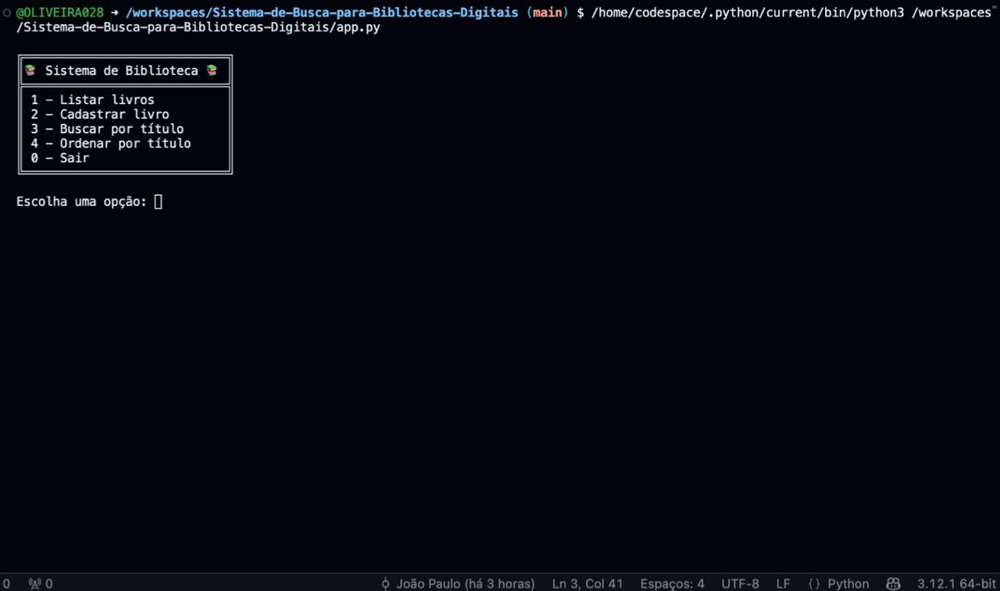
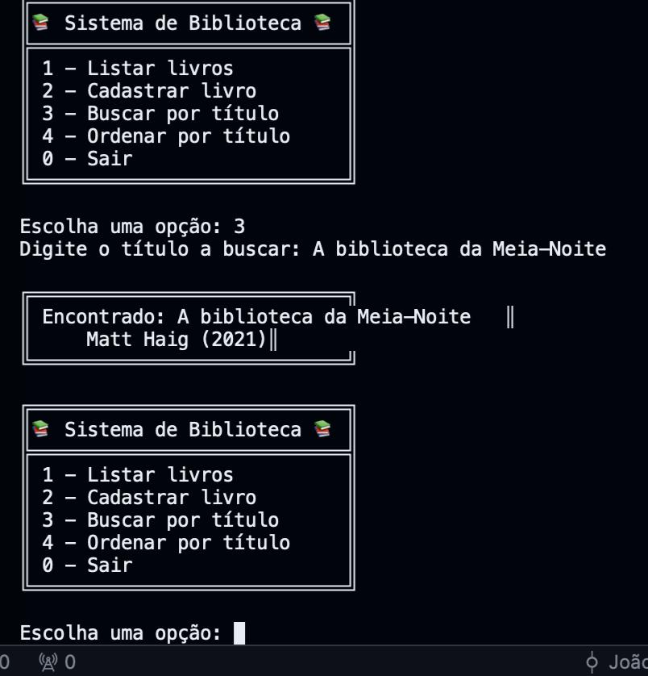
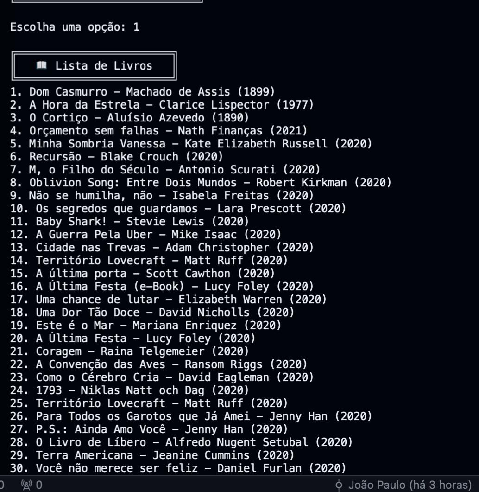
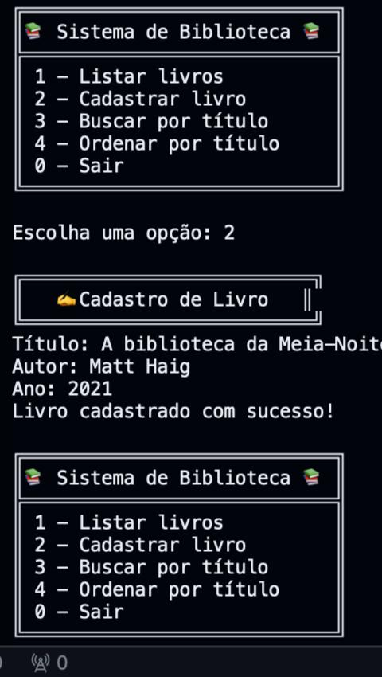
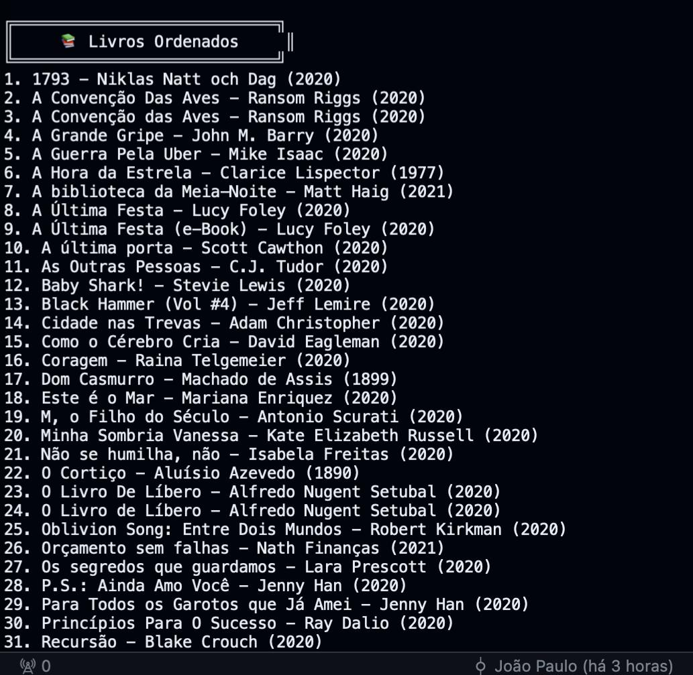

# Sistema de Busca para Bibliotecas Digitais
Projeto da disciplina de Estrutura de Dados I, com foco na implementação de um sistema de busca para bibliotecas digitais e repositórios acadêmicos, utilizando listas, dicionários, busca linear e ordenação com Quick Sort, organizados em módulos separados.

Integrantes: 
1. Aluno: João Paulo De Oliveira Vaz Santos Antão Abbade Thomaz Vilella Paiva
    RGM: 37903985
2. Aluno: Danilo Hellu Santos Ramos
    RGM: 38294605

3. Aluno: Victor Hugo Valadares Mendonça
   RGM:39423026

   
# 🎯 Objetivo Geral

O objetivo deste projeto é criar um sistema de gerenciamento de catálogo de livros 📚 usando Python, focando na aplicação prática de estruturas de dados e algoritmos fundamentais 🔍⚙️.

Mais do que só organizar livros, queremos:

- 💡 **Aplicar teoria na prática:** Transformar listas, dicionários, buscas e ordenações em funcionalidades reais que funcionam no dia a dia.
- 👩‍💻 **Desenvolver habilidades:** Escrever código limpo, organizado e eficiente, seguindo boas práticas de programação.
- 🚀 **Explorar algoritmos:** Entender como diferentes métodos de busca e ordenação funcionam na prática, para aplicar os conceitos aprendidos e organizar os dados de forma eficiente e clara.
- 📈 **Criar uma ferramenta útil:** Oferecer uma aplicação fácil de usar para cadastrar, buscar e organizar livros de forma rápida e prática.

No fim, este projeto quer ser uma ponte entre a teoria e a prática, proporcionando uma experiência legal e útil na construção de sistemas inteligentes para gerenciar informações. 🎉

## 📚 Conceitos Abordados

- 🗂️ **Estruturas de Dados Essenciais:** Uso de listas e dicionários para armazenar, acessar e manipular informações dos livros de forma organizada e eficiente.

- 🔍 **Busca Linear:** Implementação de técnicas para localizar rapidamente livros específicos dentro do catálogo, garantindo que o usuário encontre o que precisa sem complicação.

- 📊 **Algoritmos de Ordenação:** Aplicação prática de métodos como Quick Sort para ordenar os livros por título, autor ou ano, facilitando a visualização e a organização do acervo.

- 🧩 **Modularização do Código:** Separação do sistema em módulos claros e independentes, garantindo que o código seja mais fácil de entender, manter e expandir.

- 🖥️ **Interface Interativa:** Criação de um menu simples e intuitivo para que o usuário possa navegar, cadastrar, buscar e ordenar livros de maneira rápida e prática.

## 🎯 Funcionalidades

O sistema conta com várias funcionalidades pensadas para facilitar o uso e o gerenciamento do acervo:

- 📚 **Exibir todos os livros:** Mostra a lista completa de livros cadastrados, permitindo uma visão geral rápida do catálogo.

- 🔎 **Pesquisar livros:** Encontre livros usando o filtro de título tornando a busca prática e eficiente.

- 🔄 **Organizar o acervo:** Ordene os livros por título para facilitar a consulta.

- 🕹️ **Menu interativo:** Navegue facilmente pelas opções do sistema através de um menu simples e amigável no terminal, ideal para uma experiência sem complicações.


# app.py

Esse arquivo é a interface principal do sistema — é onde o menu é exibido, o usuário escolhe uma opção, e a função correta é chamada.



```python
from catalogo import listar_livros, cadastrar_livro
from busca import buscar_por_titulo
from ordenacao import ordenar_por_titulo

def menu():
    while True:
        print("\n╔" + "═"*28 + "╗")
        print("║📚 Sistema de Biblioteca 📚 ║")
        print("╠" + "═"*28 + "╣")
        print("║ 1 - Listar livros          ║")
        print("║ 2 - Cadastrar livro        ║")
        print("║ 3 - Buscar por título      ║")
        print("║ 4 - Ordenar por título     ║")
        print("║ 0 - Sair                   ║")
        print("╚" + "═"*28 + "╝")

        opcao = input("\nEscolha uma opção: ")
        
        if opcao == "1":
            print("\n╔" + "═"*24 + "╗")
            print("║   📖 Lista de Livros   ║")
            print("╚" + "═"*24 + "╝")
            listar_livros()


        elif opcao == "2":
            print("\n╔" + "═"*26 + "╗")
            print("║   ✍️ Cadastro de Livro   ║")
            print("╚" + "═"*26 + "╝")
            cadastrar_livro()

        elif opcao == "3":
            titulo = input("Digite o título a buscar: ")
            resultado = buscar_por_titulo(titulo)
            print("\n╔" + "═"*28 + "╗")
            if resultado:
                print(f"║ Encontrado: {resultado['titulo']}   ║")
                print(f"║     {resultado['autor']} ({resultado['ano']})║")
            else:
                print("║      Livro não encontrado.    ║")
            print("╚" + "═"*28 + "╝")

        elif opcao == "4":
            print("\n╔" + "═"*28 + "╗")
            print("║     📚 Livros Ordenados     ║")
            print("╚" + "═"*28 + "╝")
            ordenar_por_titulo()

        elif opcao == "0":
            print("\n╔" + "═"*28 + "╗")
            print("║🚪 Encerrando o sistema...  ║")
            print("╚" + "═"*28 + "╝")
            break

        else:
            print("\n╔" + "═"*20 + "╗")
            print("║❌ Opção inválida!  ║")
            print("╚" + "═"*20 + "╝")

menu()

```

O que cada parte faz?

Importações: Importa funções específicas dos módulos catalogo, busca e ordenacao.
Função menu():
Exibe um menu bonito usando caracteres ASCII para decorar.
Usa um loop while True para manter o sistema ativo até o usuário escolher sair.
Recebe a opção digitada pelo usuário e executa uma ação:
"1" chama listar_livros() para mostrar todos os livros cadastrados.
"2" chama cadastrar_livro() para cadastrar um novo livro.
"3" recebe um título do usuário, chama buscar_por_titulo(titulo) e mostra o resultado.
"4" chama ordenar_por_titulo() para mostrar os livros ordenados.
"0" imprime uma mensagem e sai do loop, encerrando o programa.
Caso seja digitada uma opção inválida, exibe mensagem de erro.
Chamada final menu(): inicia o programa.

# busca.py

Esse módulo é responsável por buscar livros pelo título.



```python

from dados import livros

def buscar_por_titulo(titulo_busca):
    for livro in livros:
        if livro['titulo'].lower() == titulo_busca.lower():
            return livro
    return None

```

O que ele faz?

Importa a lista global livros do arquivo dados.py.
Define a função buscar_por_titulo(titulo_busca), que:
Percorre todos os livros.
Compara o título de cada livro com o título buscado (ignorando maiúsculas/minúsculas).
Retorna o livro encontrado (um dicionário).
Caso não encontre, retorna None.

# catalogo.py

Módulo para listar os livros cadastrados e cadastrar novos livros.





```python

from dados import livros

def listar_livros():
    if not livros:
        print("\nNenhum livro cadastrado.")
        return
    for i, livro in enumerate(livros, 1):
        print(f"{i}. {livro['titulo']} - {livro['autor']} ({livro['ano']})")

def cadastrar_livro():
    titulo = input("Título: ")
    autor = input("Autor: ")
    ano = int(input("Ano: "))
    livros.append({"titulo": titulo, "autor": autor, "ano": ano})
    print("Livro cadastrado com sucesso!")

```

O que faz?

Importa livros para manipular a lista global.
listar_livros():
Se não houver livros, informa que a lista está vazia.
Caso contrário, percorre e imprime os livros numerados.
cadastrar_livro():
Solicita dados do livro via input.
Cria um novo dicionário com as informações.
Adiciona o novo livro à lista global livros.
Confirma o cadastro.

# ordenacao.py

Módulo para ordenar os livros usando QuickSort pelo título.



```python

from dados import livros

def quicksort(lista, chave):
    if len(lista) <= 1:
        return lista
    
    pivo = lista[0]
    menores = [x for x in lista[1:] if x[chave] < pivo[chave]]
    maiores = [x for x in lista[1:] if x[chave] >= pivo[chave]]
    
    return quicksort(menores, chave) + [pivo] + quicksort(maiores, chave)

def ordenar_por_titulo():
    ordenados = quicksort(livros, "titulo")
    for i, livro in enumerate(ordenados, 1):
        print(f"{i}. {livro['titulo']} - {livro['autor']} ({livro['ano']})")

```

Explicação:

Importa a lista livros.
Define quicksort(lista, chave):
Caso base: se a lista tem 1 ou 0 elementos, retorna ela.
Escolhe o primeiro elemento como pivô.
Separa os elementos menores e maiores que o pivô baseado na chave (neste caso, "titulo").
Aplica recursivamente o quicksort nas sublistas menores e maiores.
Junta os resultados com o pivô no meio.
ordenar_por_titulo():
Usa o quicksort para ordenar a lista livros pelo título.
Imprime a lista ordenada numerada.

# dados.py

Contém os dados dos livros, uma lista de dicionários.

```python

livros = [
    {"titulo": "Dom Casmurro", "autor": "Machado de Assis", "ano": 1899},
    {"titulo": "A Hora da Estrela", "autor": "Clarice Lispector", "ano": 1977},
    {"titulo": "O Cortiço", "autor": "Aluísio Azevedo", "ano": 1890},
    {"titulo": "Orçamento sem falhas", "autor": "Nath Finanças", "ano": 2021},
    {"titulo": "Minha Sombria Vanessa", "autor": "Kate Elizabeth Russell", "ano": 2020},
    {"titulo": "Recursão", "autor": "Blake Crouch", "ano": 2020},
    {"titulo": "M, o Filho do Século", "autor": "Antonio Scurati", "ano": 2020},
    {"titulo": "Oblivion Song: Entre Dois Mundos", "autor": "Robert Kirkman", "ano": 2020},
    {"titulo": "Não se humilha, não", "autor": "Isabela Freitas", "ano": 2020},
    {"titulo": "Os segredos que guardamos", "autor": "Lara Prescott", "ano": 2020},
    {"titulo": "Baby Shark!", "autor": "Stevie Lewis", "ano": 2020},
    {"titulo": "A Guerra Pela Uber", "autor": "Mike Isaac", "ano": 2020},
    {"titulo": "Cidade nas Trevas", "autor": "Adam Christopher", "ano": 2020},
    {"titulo": "Território Lovecraft", "autor": "Matt Ruff", "ano": 2020},
    {"titulo": "A última porta", "autor": "Scott Cawthon", "ano": 2020},
    {"titulo": "A Última Festa (e-Book)", "autor": "Lucy Foley", "ano": 2020},
    {"titulo": "Uma chance de lutar", "autor": "Elizabeth Warren", "ano": 2020},
    {"titulo": "Uma Dor Tão Doce", "autor": "David Nicholls", "ano": 2020},
    {"titulo": "Este é o Mar", "autor": "Mariana Enriquez", "ano": 2020},
    {"titulo": "A Última Festa", "autor": "Lucy Foley", "ano": 2020},
    {"titulo": "Coragem", "autor": "Raina Telgemeier", "ano": 2020},
    {"titulo": "A Convenção das Aves", "autor": "Ransom Riggs", "ano": 2020},
    {"titulo": "Como o Cérebro Cria", "autor": "David Eagleman", "ano": 2020},
    {"titulo": "1793", "autor": "Niklas Natt och Dag", "ano": 2020},
    {"titulo": "Território Lovecraft", "autor": "Matt Ruff", "ano": 2020},
    {"titulo": "Para Todos os Garotos que Já Amei", "autor": "Jenny Han", "ano": 2020},
    {"titulo": "P.S.: Ainda Amo Você", "autor": "Jenny Han", "ano": 2020},
    {"titulo": "O Livro de Líbero", "autor": "Alfredo Nugent Setubal", "ano": 2020},
    {"titulo": "Terra Americana", "autor": "Jeanine Cummins", "ano": 2020},
    {"titulo": "Você não merece ser feliz", "autor": "Daniel Furlan", "ano": 2020},
    {"titulo": "O Livro De Líbero", "autor": "Alfredo Nugent Setubal", "ano": 2020},
    {"titulo": "Princípios Para O Sucesso", "autor": "Ray Dalio", "ano": 2020},
    {"titulo": "Black Hammer (Vol #4)", "autor": "Jeff Lemire", "ano": 2020},
    {"titulo": "A Convenção Das Aves", "autor": "Ransom Riggs", "ano": 2020},
    {"titulo": "As Outras Pessoas", "autor": "C.J. Tudor", "ano": 2020},
    {"titulo": "Uma Dor Tão Doce", "autor": "David Nicholls", "ano": 2020},
    {"titulo": "A Grande Gripe", "autor": "John M. Barry", "ano": 2020},
    {"titulo": "The Outsiders", "autor": "S. E. Hinton", "ano": 2020},
    {"titulo": "SuperNormal", "autor": "Greg James", "ano": 2020}
]

```

O que é?

Uma lista chamada livros.
Cada item é um dicionário com as chaves: titulo, autor e ano.
É o banco de dados "simples" do sistema, armazenando os livros na memória ou em tempo de execução.


